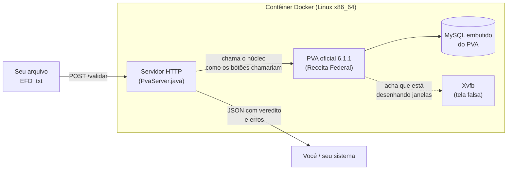

# pva-efd-api

**O PVA oficial da EFD ICMS/IPI (SPED Fiscal) rodando sem tela, dentro de um contêiner, como uma API HTTP.**

Você manda o arquivo `.txt` da EFD e recebe de volta, em JSON, o mesmo veredito que o PVA daria na tela:
*pronto para entrega* ou *reprovado*, com a lista de erros (registro, linha, campo, valor encontrado e valor esperado).

```bash
curl --data-binary @minha-efd.txt http://127.0.0.1:8095/validar
```

```json
{
  "versaoPva": "6.1.1",
  "avisos": [],
  "estado": "EM_EDICAO",
  "valido": false,
  "erros": [
    {
      "tipo": "E",
      "codigo": "MSG_VL_ICMS_ANALIT",
      "descricao": "Valor inválido. A soma do campo VL_ICMS dos registros analíticos (...) deve ser igual ao campo VL_ICMS do documento mestre (...)",
      "registro": "C100",
      "campo": "22 - VL_ICMS",
      "linha": 10,
      "valor": "180,00",
      "esperado": "170,00",
      "conteudo": "|C100|1|0|C1|55|00|001|123|...|"
    }
  ],
  "mensagens": [],
  "ms": 2226
}
```

Além do veredito do PVA, o serviço faz as conferências que **a malha da SEFAZ faz e o PVA não faz**:

| Endpoint | O que faz |
|---|---|
| `POST /validar` | Veredito e erros do PVA, com o texto oficial de cada mensagem e aviso de leiaute errado para o período. |
| `POST /analisar` | Tudo acima + resumo da apuração + verificações de malha (crédito de uso e consumo, CST sem direito a crédito, inventário de fevereiro...). |
| `POST /cruzar` | Recebe um ZIP com a EFD e os XMLs e aponta nota não escriturada, cancelada escriturada, crédito acima do destacado, crédito do Simples acima do permitido, CT-e sem ser tomador... |
| `POST /consultar` | Roda um `SELECT` no banco que o PVA montou com o arquivo (relatórios próprios sem escrever leitor de EFD). |
| `GET /tabelas/{nome}` | Tabelas oficiais que o PVA baixa da Receita (CFOP, códigos de ajuste por UF, leiautes) filtradas por UF, código e data. |
| `GET /mensagens/{codigo}` | O catálogo de mensagens do validador. |

Detalhes em [docs/api.md](docs/api.md); a lista das verificações e o porquê de cada uma em
[docs/verificacoes.md](docs/verificacoes.md).

> **Não é uma reimplementação das regras.** É o próprio PVA da Receita Federal, baixado do site oficial
> durante o build, com as mesmas regras e as mesmas tabelas. Este projeto só troca "clicar nos botões"
> por "chamar uma URL".

---

## Para que serve

- Validar **dezenas ou centenas** de EFDs de uma vez (retificadoras, auditorias, migrações) sem abrir o PVA arquivo por arquivo.
- Colocar o PVA como **portão automático** num sistema: o arquivo gerado só segue se o PVA aprovar.
- Ter o resultado da validação em **formato de dados** (JSON/CSV) em vez de um relatório de tela.
- Achar, **antes da entrega**, o que a malha fiscal vai cruzar: EFD × XML, créditos indevidos, cadeia de saldo credor.

## Como funciona, em uma imagem



Explicação completa, sem jargão: **[docs/como-funciona.md](docs/como-funciona.md)**.

---

## Começo rápido

### O que você precisa

- **Docker** com Docker Compose.
- Máquina **x86_64** (Linux, Windows com WSL2, Mac Intel), **ou** Mac com Apple Silicon usando emulação (funciona, mais devagar; veja abaixo).
- ~3 GB livres em disco e 2 GB de RAM para o contêiner.
- Acesso à internet no build (baixa o instalador do PVA de `servicos.receita.fazenda.gov.br`) e no uso (atualização das tabelas externas).
- **Estar no Brasil** na hora do build: o site da Receita costuma recusar conexões de outros países (inclusive
  servidores de CI como o GitHub Actions). Fora do Brasil, baixe o instalador à mão e coloque em
  [`instalador/`](instalador/LEIA-ME.md).

### Subir o serviço

```bash
git clone https://github.com/chapzin/pva-efd-api.git
cd pva-efd-api
docker compose up -d --build
```

O primeiro build baixa ~185 MB do site da Receita e leva alguns minutos. Depois disso o contêiner ainda
demora de 15 s a 2 min para ficar pronto (liga o MySQL embutido e baixa as tabelas externas). Acompanhe com:

```bash
curl http://127.0.0.1:8095/saude
```

Quando responder `"ok":true`, está pronto.

### Validar um arquivo

```bash
curl --data-binary @minha-efd.txt http://127.0.0.1:8095/validar
```

Ou, com saída formatada:

```bash
./exemplos/validar.sh minha-efd.txt
```

### Validar uma pasta inteira

```bash
python3 exemplos/validar_lote.py 'minhas-efds/*.txt' resultados
```

Gera um `.json` por arquivo e um `resultados/resumo.csv` (abre no Excel, separado por `;`) com estado,
quantidade de erros e os erros mais frequentes de cada arquivo.

Com `--analisar`, vira o painel da carteira: `erros-por-mensagem.csv` (o erro que se repete em todos os
clientes), `verificacoes.csv` (achados de malha por arquivo) e `saldo-credor.csv` (meses em que o saldo credor
transportado não bate com o do mês seguinte).

```bash
python3 exemplos/validar_lote.py 'minhas-efds/*.txt' resultados --analisar
```

### Cruzar com os XMLs

```bash
zip -j lote.zip minha-efd.txt xmls/*.xml
curl --data-binary @lote.zip http://127.0.0.1:8095/cruzar
```

### Conferir que tudo funciona

O repositório traz três EFDs **100% fictícias** (CNPJ, IE e chave de NF-e inventados, com dígitos verificadores válidos):

```bash
make teste
```

- `exemplos/efd-exemplo-valido.txt`: tem que sair `GERADA_PARA_ENTREGA`.
- `exemplos/efd-exemplo-com-erro.txt`: tem que sair reprovado com `MSG_VL_ICMS_ANALIT` (ICMS do C190 diferente do C100).
- `exemplos/efd-exemplo-malha.txt` + `exemplos/xml-malha/`: passa no PVA, mas `/analisar` aponta crédito de uso e
  consumo e `/cruzar` aponta uma nota não escriturada e crédito de fornecedor do Simples acima do permitido.

---

## Mac com Apple Silicon (M1/M2/M3/M4)

O PVA só existe para Linux x86_64 (o MySQL embutido dele é até 32 bits). No Mac ARM o Docker roda a imagem
emulada: funciona igual, só mais devagar (boot ~12 s em vez de ~3 s; 12–60 s por arquivo em vez de poucos segundos).

- **Colima:** `colima start --arch aarch64 --vm-type vz --vz-rosetta` (usa o Rosetta, bem mais rápido que QEMU).
- **Docker Desktop:** ative *Use Rosetta for x86_64/amd64 emulation on Apple Silicon* nas configurações.

Para volume grande, prefira um servidor x86_64 (qualquer VPS Linux comum).

---

## Documentação

| Documento | Para quem | O que tem |
|---|---|---|
| [docs/como-funciona.md](docs/como-funciona.md) | Qualquer pessoa | A ideia toda explicada sem jargão técnico |
| [docs/api.md](docs/api.md) | Quem vai integrar | Endpoints, campos do JSON, códigos HTTP, variáveis de ambiente |
| [docs/verificacoes.md](docs/verificacoes.md) | Contadores e auditores | O que `/analisar` e `/cruzar` conferem e por quê |
| [docs/arquitetura.md](docs/arquitetura.md) | Desenvolvedores | Como o servidor conversa com o núcleo do PVA, por dentro |
| [docs/solucao-de-problemas.md](docs/solucao-de-problemas.md) | Quem opera | Sintomas conhecidos e como resolver |
| [docs/regras-do-pva.md](docs/regras-do-pva.md) | Contadores e auditores | Comportamentos do PVA 6.1.1 observados na prática |
| [docs/nova-versao-do-pva.md](docs/nova-versao-do-pva.md) | Mantenedores | Como atualizar quando a Receita lançar outro PVA |

---

## Segurança e privacidade

- O serviço **não tem autenticação**. Por padrão ele só escuta em `127.0.0.1` (a própria máquina).
  Não exponha a porta na internet sem um proxy com autenticação na frente.
- O arquivo enviado é gravado num temporário dentro do contêiner, validado e **apagado** logo em seguida;
  a escrituração também é apagada do banco embutido do PVA depois de cada validação (vale também para os XMLs do `/cruzar`,
  que são lidos em memória).
- `/consultar` aceita só um `SELECT` e roda no banco temporário daquele arquivo.
- Nenhum dado sai da sua máquina, exceto as consultas que o **próprio PVA** faz à Receita para baixar as
  tabelas externas (as mesmas que o PVA faz quando você o usa na tela).

## Limitações

- **Uma validação por vez.** O PVA é um programa de usuário único (um banco embutido, uma escrituração aberta).
  Pedidos simultâneos esperam na fila. Para paralelizar, suba vários contêineres.
- **As verificações de malha são indícios**, não auto de infração: regras estaduais e benefícios podem
  justificar o que parece erro. Cada achado traz o fundamento para o contador decidir.
- **Só valida.** Não assina, não transmite e não gera recibo. A entrega continua sendo pelo ReceitanetBX.
- **Arquivo assinado** precisa ter a assinatura removida antes (apague tudo depois da linha `|9999|`); o PVA abre
  arquivo assinado só para visualização.
- Cobre a **EFD ICMS/IPI** (SPED Fiscal). EFD-Contribuições, ECD e ECF usam PVAs diferentes e não estão incluídos.

## Aviso legal

Projeto independente, **sem vínculo** com a Receita Federal do Brasil ou com o Serpro.
O PVA (Programa Validador e Assinador) é software da Receita Federal/Serpro; **nenhum arquivo dele é distribuído
neste repositório**: o `Dockerfile` baixa o instalador do endereço oficial e confere o SHA-256.
O resultado da validação é o que o PVA oficial devolve, mas a responsabilidade pela escrituração continua sendo
do contribuinte e do contador. Use por sua conta e risco.

O código deste repositório (servidor, scripts, exemplos e documentação) está sob a [licença MIT](LICENSE).
