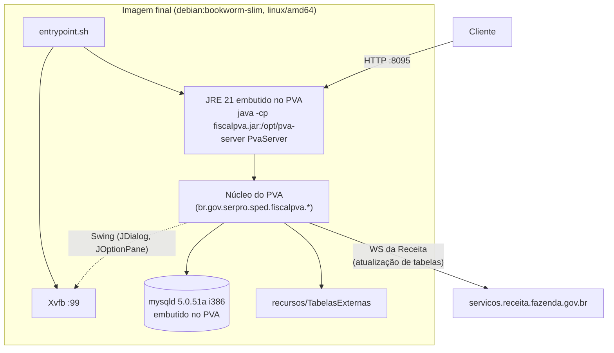

# Arquitetura (para desenvolvedores)

Tudo o que o projeto faz está em dois arquivos: [`Dockerfile`](../Dockerfile) e
[`src/PvaServer.java`](../src/PvaServer.java). Este documento explica as decisões e as APIs internas do PVA
usadas, descobertas com `javap` nos jars instalados.

> As classes `br.gov.serpro.*` são internas do PVA, **não são API pública** e podem mudar em qualquer versão.
> O projeto fixa a versão (6.1.1) e o SHA-256 do instalador justamente por isso.

## Visão geral



## Build em três estágios

1. **`instalador`**: baixa `SpedEFD_linux_x86_64-<versão>.sh` (instalador install4j), confere o SHA-256 e
   instala em modo silencioso (`-q -dir /opt/pva`). O install4j ignora qualquer JDK externo e usa o JRE
   Temurin 21 que vem dentro do instalador. Em seguida, `spedfiscal.properties` recebe
   `nuncaVerificarAtualizacoes=true`, porque o diálogo de "atualizar tabelas" no boot é **modal** e travaria
   a JVM para sempre.
2. **`compilador`**: `javac` do `PvaServer.java` contra `/opt/pva/fiscalpva.jar`. O manifest desse jar traz o
   `Class-Path` com todos os outros jars do PVA, então um único `-cp` basta.
3. **Imagem final**: Debian slim com
   - bibliotecas **i386** (`libc6`, `libstdc++6`, `zlib1g`, `libncurses5`, `libcrypt1`): o `mysqld` embutido
     é o MySQL 5.0.51a de 32 bits, extraído do `bdembutido-mysql.jar` na primeira execução;
   - `xvfb` e bibliotecas X/fontes: o núcleo ainda instancia Swing;
   - symlinks em `/usr/local/mysql`: o `mysqld` foi compilado com esse prefixo e resolve `share/mysql` e
     `data` relativos a ele;
   - usuário não-root: o `mysqld` 5.0 se recusa a rodar como root.

## Boot do servidor

```java
InicializacaoSistemaSPEDFiscalPVA.getSingleton().iniciarSPEDFiscalPVA();
controle = FabricaControle.getSingleton().getServico(IControleImportacaoExportacaoEscrituracao.class);
```

`iniciarSPEDFiscalPVA()` faz o que a tela de splash faz: sobe o MySQL embutido, carrega descritores de leiaute
e tabelas externas. Leva ~3 s em x86_64 nativo e ~12 s emulado.

## Validar = importar

No PVA não existe "validar sem importar": a importação grava a escrituração no banco embutido e roda as regras.

```java
controle.importarEscrituracao(caminho, ui, progresso, false, 1000, 1000);
```

- `ui` é um `java.lang.reflect.Proxy` de `IInteracaoImportacaoEscrituracao`, a interface que a tela implementa.
  O proxy **responde aos diálogos** como um operador: `true` para confirmações, "SIM"/"OK" em enums, e
  **captura a `EscrituracaoFiscal`** que chega como argumento dos callbacks `exibirRelatorio*`.
- Pergunta "atualizar tabelas antes de validar?": o retorno é um `ExibirMensagem$SelecaoOptionPane`. A opção
  `0` abre o modal de download e trava; `null` dá `NullPointerException`. O proxy devolve uma instância com
  `setOpcao(1)` (não), já que as tabelas são atualizadas por fora.
- `progresso` é outro proxy (`IMostrarProgresso`) que ignora tudo.

O veredito sai de `capturada.getEstado()`:

| Estado | Significado |
|---|---|
| `GERADA_PARA_ENTREGA`, `VALIDADA` | Aprovado. |
| `EM_EDICAO` | Reprovado: erros na tabela de inconsistências. |
| `null` | Arquivo não integrado (erro estrutural). |

## Onde estão os erros

**Arquivo integrado e reprovado:** o PVA grava as inconsistências numa tabela do banco da escrituração cujo
nome contém `inconsist`. O servidor abre a persistência da própria escrituração e lê de lá:

```java
IPersistencia per = PersistenciaFiscalPVA.getSingleton().abrirPersistencia(esc);
per.executarComandoSql("SELECT TIPO, ID_MENSAGEM, NOME_REGISTRO, ID_CAMPO, NUMERO_LINHA, "
    + "VALOR_CAMPO, VALOR_ESPERADO_CAMPO, CONTEUDO_LINHA FROM <tabela> ORDER BY NUMERO_LINHA LIMIT 500");
```

**Arquivo não integrado:** `importarEscrituracao` chama `exibirRelatorioNaoIntegradoComEdicao` e **descarta**
o mapa de erros. O servidor reimporta pela fachada de baixo nível, que devolve o `ResultadoValidacao` com
`getMapErros()`:

```java
ILeitorEscrituracao l = new LeitorArquivoHierarquicoInputStreamFiscal(in, esc.getDescritor());
ResultadoValidacao r = FachadaValidadorSPEDFiscal.importarEscrituracao(l, esc, progresso, 1000, 1000, new SessaoVep());
```

Nesse caminho o tipo vem como enum (`ERRO`/`ADVERTENCIA`); o servidor normaliza para a inicial (`E`/`A`) para
as duas origens terem o mesmo formato.

Depois de cada validação, `ControleEscrituracaoFiscal.apagarEscrituracaoBanco(esc)` remove a escrituração do
banco embutido. Sem isso o banco cresce a cada arquivo.

## Tabelas externas sem diálogo

`ControleAtualizarTabela.atualizarTabelas()` (o que o menu chama) abre um diálogo modal de seleção. O caminho
sem tela é a fachada do subsistema de tabelas, com dois proxies:

```java
SistemaTabelas.atualizarTabelas(seletor, monitor);
InicializacaoTabelasExternas.getSingleton().carregarTabelas();
```

- `ISeletorTabelasAtualizar`: recebe em `setPacotesComTabelasAtualizar` tudo o que o WS publicou com versão
  mais nova que a local; o proxy marca todas e devolve em `getTabelasSelecionadasParaAtualizar`.
- `IMonitorTransferenciaTabela`: recebe o andamento e registra sucesso/falha por tabela.

A atualização roda no boot e a cada `PVA_ATUALIZAR_TABELAS_HORAS`, no **mesmo lock** das validações
(`static synchronized`), para nunca trocar tabela no meio de uma validação.

## Concorrência

O PVA é singleton: um MySQL embutido, uma escrituração "aberta", estado estático espalhado pelo núcleo.
`validar()` e `atualizarTabelas()` são `static synchronized`. O `HttpServer` usa um pool de 4 threads só para
que `/saude` responda enquanto uma validação longa segura o lock. Para validar em paralelo, rode vários
contêineres (cada um com seu MySQL) atrás de um balanceador.

## Travamentos que o servidor contorna

| Sintoma | Causa | Contorno |
|---|---|---|
| `HeadlessException` no boot | Núcleo instancia Swing | Xvfb + `DISPLAY=:99` |
| Validação nunca termina | Diálogo modal esperando clique | Proxy responde; `nuncaVerificarAtualizacoes=true` |
| Validação presa após assinar/verificar | `DialogoProgressoAssinatura` às vezes abre depois da tarefa e nunca fecha | Vigia a cada 5 s fecha esse diálogo se ficar 30 s visível |
| `xvfb-run` trava sob emulação | Espera um `SIGUSR1` que não chega no amd64 emulado | `Xvfb &` direto no `entrypoint.sh` |
| Contêiner reiniciado fica "saudável" mas falha tudo com `AWTError` | Lock `/tmp/.X99-lock` antigo impede o Xvfb novo | `entrypoint.sh` apaga o lock antes; `/saude` testa o socket do display; se o Xvfb morrer, o contêiner sai e reinicia |

## Como investigar a API interna

Para outra versão do PVA, os pontos de entrada podem mudar de nome. O caminho usado aqui:

```bash
# copiar a instalação do PVA para fora da imagem
docker create --name pva-copia pva-efd-api:6.1.1
docker cp pva-copia:/opt/pva ./pva-instalado && docker rm pva-copia

# listar classes e ver assinaturas (JDK 21 local; o JRE do PVA não traz jar/javap)
unzip -l pva-instalado/fiscalpva.jar | grep -i importacao
javap -cp "pva-instalado/fiscalpva.jar" \
  br.gov.serpro.sped.fiscalpva.nucleo.controle.importacao.escrituracao.IControleImportacaoExportacaoEscrituracao
```

Muitas regras globais (`RegraValida*`) só referenciam `EnumQueries.X`; o SQL fica em
`descritor/comum/queries/queries.xml` dentro de `fiscalpva-dominio.jar`, útil para entender por que uma regra
dispara.
