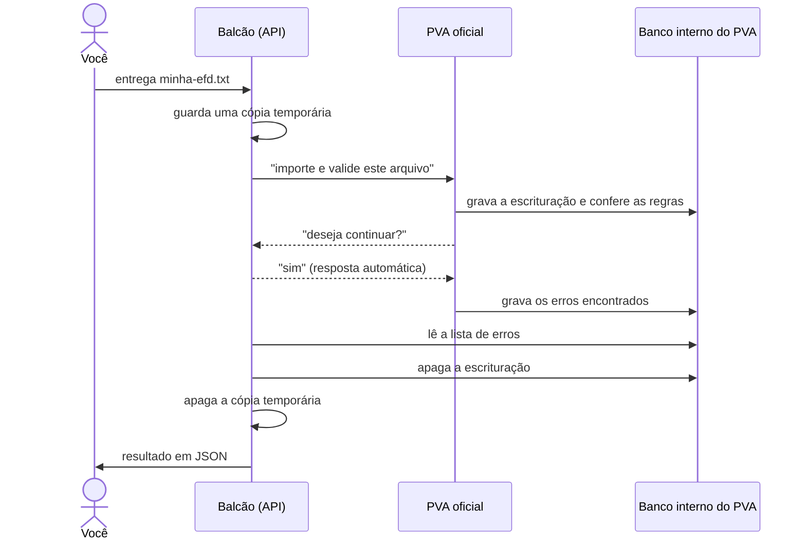

# Como funciona (explicado sem jargão)

Este texto é para quem nunca mexeu com Docker, Java ou API. Se você só quer usar, o
[README](../README.md) basta. Se quer entender **por que funciona**, siga aqui.

---

## 1. O ponto de partida: o PVA

Todo contador que entrega a **EFD ICMS/IPI** (o "SPED Fiscal") conhece o **PVA**, o *Programa Validador e
Assinador* da Receita Federal. Você abre o programa, clica em **Importar**, escolhe o arquivo `.txt`, espera,
e ele diz uma de duas coisas:

- ✅ o arquivo está **pronto para entrega**; ou
- ❌ tem **erros**, e mostra uma lista: em qual registro, em qual linha, qual valor estava lá e qual era o esperado.

O PVA é a palavra final: se ele aprovar, a Receita aceita receber o arquivo.

## 2. O problema

O PVA foi feito para **uma pessoa, na frente de uma tela, clicando em botões**.

Isso funciona para um arquivo. Mas e quando você precisa validar 40 retificadoras de uma empresa? Ou quer que
um sistema gere a EFD e só libere se o PVA aprovar? Aí seria preciso alguém sentado clicando, arquivo por
arquivo, anotando os erros à mão.

Existem programas que tentam **imitar** as regras do PVA, mas imitação sempre fica para trás: a Receita muda
uma regra, a imitação continua aprovando o que o PVA de verdade recusa.

**A ideia deste projeto:** não imitar nada. Usar o **próprio PVA**, só que sem ninguém clicando.

## 3. As quatro peças

Pense numa repartição com um funcionário muito competente (o PVA) que só trabalha se estiver sentado na frente
de um monitor e alguém lhe entregar os papéis em mãos. Montamos quatro coisas em volta dele.

### Peça 1: uma sala própria (o contêiner Docker)

O PVA só roda em computador **Linux de processador Intel/AMD** (e até usa peças antigas de 32 bits). Nem todo
mundo tem essa máquina, e ninguém quer instalar software antigo misturado no próprio computador.

O **Docker** cria uma "sala" isolada dentro do seu computador: um Linux completo, em miniatura, com só o que o
PVA precisa. Tudo o que acontece lá dentro fica lá dentro. Se der problema, você joga a sala fora e monta de
novo, do mesmo jeito, em minutos.

Essa sala é descrita num arquivo de receita (o `Dockerfile`), que diz passo a passo:

1. pegue um Linux básico;
2. baixe o instalador do PVA **do site da Receita** e confira se é exatamente o arquivo oficial (pela "impressão
   digital" SHA-256, que muda se qualquer byte for diferente);
3. instale o PVA sem perguntas;
4. desligue a pergunta "deseja atualizar as tabelas?", porque ninguém vai estar lá para responder;
5. instale as peças antigas que o banco de dados interno do PVA exige.

Qualquer pessoa, em qualquer lugar, que seguir essa receita obtém **a mesma sala**. É isso que torna o projeto
replicável.

### Peça 2: um monitor de mentira (o Xvfb)

Mesmo quando não mostra nada, o PVA **insiste em ter uma tela**. Sem monitor, ele se recusa a ligar.

O **Xvfb** é um "monitor imaginário": para o PVA, parece uma tela de verdade, com 1280×1024 pixels. Ele desenha
suas janelas ali normalmente, só que ninguém nunca vê. Problema resolvido sem precisar de monitor.

### Peça 3: alguém que aperta os botões (o PvaServer)

Quando você clica em **Importar** no PVA, o botão apenas chama uma função interna do programa, algo como
"importe e valide este arquivo". O botão é só a porta de entrada.

O `PvaServer` é um programa pequeno (um arquivo Java) que **liga o PVA e chama essas mesmas funções internas
diretamente**, sem passar pelos botões. É exatamente o que aconteceria se você clicasse, só que feito por código.

E quando o PVA faz uma pergunta no meio do caminho, como "deseja continuar?", o `PvaServer` responde sozinho,
do jeito que um operador responderia. Sem isso, o PVA ficaria parado para sempre esperando alguém clicar em "OK".

No fim, o `PvaServer` vai até o banco de dados interno do PVA, na mesma tabela de onde a tela tira a lista de
erros, e copia essa lista.

### Peça 4: um balcão de atendimento (a API HTTP)

Para que outros programas (ou você, pelo terminal) possam entregar arquivos, o `PvaServer` abre um "balcão" num
endereço de rede, `http://127.0.0.1:8095`. O `127.0.0.1` significa "este próprio computador": ninguém de fora
consegue chegar nele.

O balcão tem três guichês:

| Guichê | O que você entrega | O que recebe |
|---|---|---|
| `/validar` | o arquivo `.txt` da EFD | o veredito e a lista de erros |
| `/saude` | nada | "estou funcionando?", e quantas tabelas da Receita estão carregadas |
| `/tabelas/atualizar` | nada | baixa agora as tabelas mais novas da Receita |

## 4. O caminho de um arquivo, passo a passo



## 5. Como ler a resposta

A resposta vem num formato chamado **JSON**: texto organizado em "etiqueta: valor", que tanto pessoas quanto
programas conseguem ler.

```json
{
  "estado": "EM_EDICAO",
  "valido": false,
  "erros": [
    {
      "tipo": "E",
      "registro": "C100",
      "campo": "22 - VL_ICMS",
      "linha": 10,
      "valor": "180,00",
      "esperado": "170,00"
    }
  ]
}
```

Traduzindo:

- **`estado`** é o estado em que o PVA deixou a escrituração:
  - `GERADA_PARA_ENTREGA` (ou `VALIDADA`): **aprovado**, é o sinal verde do PVA;
  - `EM_EDICAO`: **reprovado**, precisa corrigir.
- **`valido`** é o mesmo veredito em forma de sim/não (`true`/`false`).
- **`erros`** é a lista que o PVA mostraria na tela. Cada item diz:
  - `tipo`: `E` = erro (impede a entrega), `A` = advertência (só um aviso);
  - `registro` e `linha`: onde está o problema no arquivo;
  - `campo`: qual informação do registro;
  - `valor` e `esperado`: o que estava lá e o que o PVA calculou que deveria estar.

No exemplo: na linha 10, o C100 diz que o ICMS da nota é R$ 180,00, mas a soma dos C190 dessa nota dá
R$ 170,00. Uma das duas informações está errada.

## 6. Por que dá para confiar no resultado

Porque **quem valida é o PVA oficial**, a mesma versão, as mesmas regras, as mesmas tabelas da Receita que você
usaria na tela. O projeto não decide nada: só entrega o arquivo e copia a resposta.

As **tabelas externas** (códigos de ajuste, códigos de receita, etc.) mudam com o tempo. Por isso o serviço
baixa as tabelas atualizadas da Receita quando liga e depois a cada 24 horas, exatamente como o PVA faria se
você clicasse em "atualizar tabelas".

## 7. Cuidados

- **Um arquivo por vez.** O PVA foi feito para uma pessoa só; se chegarem dois arquivos juntos, o segundo espera
  o primeiro terminar. Para ir mais rápido, dá para ter várias "salas" (contêineres) ao mesmo tempo.
- **Só valida.** Assinar e transmitir continua sendo com o certificado digital, pelo PVA na tela ou pelo
  ReceitanetBX.
- **Mac novo (M1/M2/M3/M4) é mais lento**, porque a "sala" precisa simular um processador Intel. Funciona, mas um
  arquivo que levaria 5 segundos pode levar 40.
- **O monitor de mentira pode travar** se a sala for reiniciada de um jeito brusco. O projeto já se protege: se o
  monitor cair, a sala toda reinicia sozinha e limpa. Detalhes em
  [solucao-de-problemas.md](solucao-de-problemas.md).

## Glossário rápido

| Termo | Significado |
|---|---|
| **API** | Um "balcão" por onde um programa conversa com outro, trocando mensagens por endereços (URLs). |
| **Contêiner / Docker** | Uma "sala" isolada com um sistema completo dentro do seu computador, montada a partir de uma receita. |
| **Imagem** | A sala "congelada", pronta para ser ligada. O `docker compose build` monta a imagem; o `up` liga. |
| **Xvfb** | Um monitor imaginário para programas que exigem tela. |
| **JSON** | Formato de texto com etiquetas e valores, fácil para gente e para programa. |
| **127.0.0.1** | "Este computador". Um serviço nesse endereço não é acessível de fora. |
| **SHA-256** | A "impressão digital" de um arquivo; garante que é exatamente o arquivo oficial. |
| **Headless** | "Sem cabeça": rodar um programa sem tela e sem ninguém operando. |
